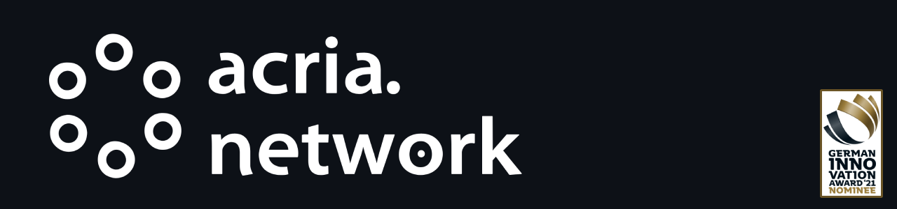

# Acria-Contracts
Contracts for the ETH branch of the Acria Network.


One of the most pressing issues when developing smart contracts is the lack of real-world data. But due to technical limitations, such as the consensus protocol, no blockchain has been able to solve this major limitation. The Acria Network solves exactly this problem with the help of so-called Oracle Nodes that don't require a middleman. In addition to this, it offers cross-chain support to supply various blockchains with real-world data.

[https://acria.network/](https://https://acria.network/)

## Building

Windows & OS X & Linux:

```sh
truffle develop
migrate
```

## Whitepaper / Technical Specification

<a href="https://acria.network/whitepaper" target="_blank"></a>

## Aims

The Acria Network has many design goals in order to achieve all its goals.

### Cross-Chain

Every single process has to be optimized to allow cross-chain communication with various different blockchains. On top of this, as many crypto currencies as possible should be use-able as collateral and therefore stake-able.

### Easy to use

By allowing the user to use their preferred cryptocurrency as collateral we completely eliminate the hassle of acquiring the currency used by the network. In addition to this, every end-user program is optimized to be simple and as straightforward as possible to use.

### Extensibility and Scalability

By design, the Acria Network is designed to allow the easy implementation of publicly available data by the initial distributor of that data. This guarantees that the network is always up to date with the needs of its users. On top of this it is able to keep the latency very low and the throughput high.

### Trustworthy

The Acria Network only allows the owner of the data to operate an oracle node. The other users are then allowed to stake their preferred currency on those oracle nodes. Should the operator of the oracle publish incorrect data, some of the stakers gains will be slashed. Therefore the stakers give validity to the data provided by the oracle node as they prefer to only stake on the most trustworthy nodes.

## License


Distributed under the MIT license. See ``LICENSE`` for more information.


## Meta

Acria Network – [@acrianetwork](https://twitter.com/acrianetwork) – help@acria.network

[https://github.com/Acria-Network/Acria-Contracts](https://github.com/Acria-Network/Acria-Contracts)
